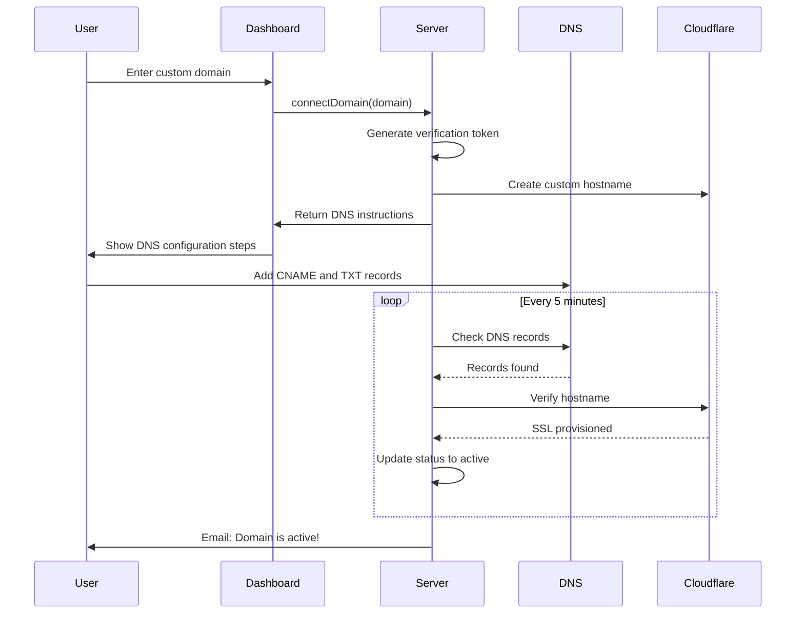

# Custom Domain System - Implementation Guide

> Enterprise-level custom domain system for Kaka Malem multi-tenant shop builder

## Overview

This document describes the custom domain system that enables store owners to use their own domains (e.g., `shop.mybrand.com` or `mybrand.com`) instead of the default `kakamalem.com/store/[slug]` URL.

## Current Implementation: Caddy with On-Demand TLS

**Status: IMPLEMENTED** ✅

The system uses Caddy server with on-demand TLS for automatic SSL certificate provisioning.

### Why Caddy?

| Feature          | Caddy                         | Cloudflare for SaaS      |
| ---------------- | ----------------------------- | ------------------------ |
| SSL Provisioning | Automatic via Let's Encrypt   | Automatic                |
| Cost             | Free (self-hosted)            | $2/hostname after 100    |
| Setup Complexity | Simple single binary          | API integration required |
| On-Demand TLS    | Built-in                      | Via SSL for SaaS feature |
| Control          | Full control, self-hosted     | Vendor dependency        |
| CDN              | None (use separate if needed) | Built-in global CDN      |

**Chosen: Caddy** - Simpler setup, zero cost, full control, and the on-demand TLS feature handles SSL certificate provisioning automatically when a new domain connects.

---

## Database Schema Changes

### New Fields in `tenants` Table

```typescript
// lib/db/schema.ts additions
{
  // Custom domain configuration
  customDomain: varchar("custom_domain", { length: 255 }).unique(),
  customDomainStatus: varchar("custom_domain_status", { length: 20 })
    .default("pending"),
  domainVerificationToken: varchar("domain_verification_token", { length: 64 }),
  domainVerifiedAt: timestamp("domain_verified_at", { withTimezone: true }),

  // SSL tracking
  sslStatus: varchar("ssl_status", { length: 20 }).default("pending"),
  sslProvisionedAt: timestamp("ssl_provisioned_at", { withTimezone: true }),

  // Cloudflare reference
  cloudflareHostnameId: varchar("cloudflare_hostname_id", { length: 64 }),

  // Status tracking
  domainDnsRecords: jsonb("domain_dns_records").$type<DnsRecords>(),
  domainError: text("domain_error"),
  domainLastCheckedAt: timestamp("domain_last_checked_at", { withTimezone: true }),
}
```

### Domain Status Flow

```
pending → dns_verification → ssl_provisioning → active
                ↓                    ↓
              error ←←←←←←←←←←←← error
```

| Status             | Description                              |
| ------------------ | ---------------------------------------- |
| `pending`          | Domain added, awaiting DNS configuration |
| `dns_verification` | Checking DNS records                     |
| `ssl_provisioning` | DNS verified, provisioning SSL           |
| `active`           | Fully configured and working             |
| `error`            | Configuration error (see domainError)    |
| `suspended`        | Manually suspended by admin              |

---

## DNS Verification System

### Required DNS Records

**For subdomain (shop.example.com):**

```
Type: CNAME
Name: shop
Target: proxy.kakamalem.com
```

**For apex domain (example.com):**

```
Type: CNAME (if registrar supports CNAME flattening)
Name: @
Target: proxy.kakamalem.com

OR

Type: A
Name: @
Target: [Cloudflare IP provided during setup]
```

**Verification record (required for both):**

```
Type: TXT
Name: _kakamalem-verify
Value: verify=km_{verification_token}
```

### Verification Flow



---

## Domain Resolution

### Middleware Logic

```typescript
// middleware.ts
export async function middleware(request: NextRequest) {
  const hostname = request.headers.get("host");

  // Skip main domain
  if (hostname === "kakamalem.com" || hostname === "www.kakamalem.com") {
    return NextResponse.next();
  }

  // Custom domain detected - rewrite to internal route
  const url = request.nextUrl.clone();
  url.pathname = `/store/custom-domain${url.pathname}`;
  url.searchParams.set("_host", hostname);

  return NextResponse.rewrite(url);
}
```

### Tenant Lookup

```typescript
// lib/db/queries/tenants.ts
export async function getTenantByCustomDomain(domain: string) {
  return db.query.tenants.findFirst({
    where: and(
      eq(tenants.customDomain, domain),
      eq(tenants.customDomainStatus, "active")
    ),
  });
}
```

---

## Caddy Configuration

### Caddyfile Setup

The Caddy server is configured with on-demand TLS to automatically provision SSL certificates for custom domains.

```caddyfile
# /etc/caddy/Caddyfile

{
    on_demand_tls {
        ask http://localhost:3000/api/domains/verify
    }
}

# Main domain
kakamalem.com, www.kakamalem.com {
    reverse_proxy localhost:3000
}

# Custom domains - on-demand TLS
:443 {
    tls {
        on_demand
    }
    reverse_proxy localhost:3000
}
```

### Domain Verification Endpoint

The `/api/domains/verify` endpoint validates that a custom domain is registered before Caddy provisions an SSL certificate:

```typescript
// app/api/domains/verify/route.ts
export async function GET(request: Request) {
  const { searchParams } = new URL(request.url);
  const domain = searchParams.get("domain");

  if (!domain) {
    return new Response("Missing domain", { status: 400 });
  }

  // Check if domain is registered and verified
  const tenant = await getTenantByCustomDomain(domain);

  if (tenant && tenant.customDomainStatus === "active") {
    return new Response("OK", { status: 200 });
  }

  return new Response("Domain not found", { status: 404 });
}
```

### Environment Variables

```bash
# .env
NEXT_PUBLIC_APP_URL=https://kakamalem.com
```

---

## Server Actions

### Domain Management API

```typescript
// lib/actions/domains.ts
"use server";

// Connect a custom domain
export async function connectDomain(
  storeId: string,
  domain: string
): Promise<ActionResult<{ dnsInstructions: DnsInstructions }>>;

// Manually trigger verification
export async function verifyDomain(
  storeId: string
): Promise<ActionResult<{ status: DomainStatus }>>;

// Disconnect custom domain
export async function disconnectDomain(storeId: string): Promise<ActionResult>;

// Refresh status from Cloudflare
export async function refreshDomainStatus(
  storeId: string
): Promise<ActionResult<{ status: DomainStatus; sslStatus: SslStatus }>>;
```

### Validation Schema

```typescript
// lib/validations/domains.ts
import { z } from "zod";

const domainRegex = /^(?:[a-z0-9](?:[a-z0-9-]{0,61}[a-z0-9])?\.)+[a-z]{2,}$/i;

export const customDomainSchema = z.object({
  domain: z
    .string()
    .min(4, "Domain must be at least 4 characters")
    .max(255, "Domain must be less than 255 characters")
    .regex(domainRegex, "Please enter a valid domain name")
    .transform((d) => d.toLowerCase().trim())
    .refine(
      (d) => !d.endsWith("kakamalem.com"),
      "Cannot use kakamalem.com subdomains"
    ),
});
```

---

## Background Jobs

### Domain Health Check (Cron)

```typescript
// app/api/cron/domain-health/route.ts
// Runs every 5 minutes via external cron (Vercel Cron, GitHub Actions, etc.)

export async function GET(request: Request) {
  // 1. Verify cron secret
  const authHeader = request.headers.get("authorization");
  if (authHeader !== `Bearer ${process.env.CRON_SECRET}`) {
    return Response.json({ error: "Unauthorized" }, { status: 401 });
  }

  // 2. Get domains needing verification
  const pendingDomains = await db.query.tenants.findMany({
    where: inArray(tenants.customDomainStatus, ["pending", "dns_verification"]),
  });

  // 3. Check each domain
  for (const tenant of pendingDomains) {
    await checkAndUpdateDomainStatus(tenant);
  }

  // 4. Check active domains for health (less frequently)
  // ...

  return Response.json({ checked: pendingDomains.length });
}
```

---

## Frontend Components

### Domain Settings Form

```
┌─────────────────────────────────────────────────────────────┐
│ Your Store URL                                              │
├─────────────────────────────────────────────────────────────┤
│ 🌐 kakamalem.com/store/mybrand                    [Active]  │
│    Free subdomain included with your store                  │
│                                          [Visit Store]      │
└─────────────────────────────────────────────────────────────┘

┌─────────────────────────────────────────────────────────────┐
│ Custom Domain                                               │
├─────────────────────────────────────────────────────────────┤
│                                                             │
│ Connect your own domain to your store                       │
│                                                             │
│ ┌─────────────────────────────────────────────────────────┐ │
│ │ shop.mybrand.com                              [Connect] │ │
│ └─────────────────────────────────────────────────────────┘ │
│                                                             │
│ Examples: shop.mybrand.com, store.mybrand.com, mybrand.com  │
└─────────────────────────────────────────────────────────────┘
```

### DNS Instructions Component

```
┌─────────────────────────────────────────────────────────────┐
│ Configure DNS Records                                       │
├─────────────────────────────────────────────────────────────┤
│                                                             │
│ Add these records at your domain registrar:                 │
│                                                             │
│ Step 1: Point your domain to our servers                    │
│ ┌─────────────────────────────────────────────────────────┐ │
│ │ Type: CNAME                                             │ │
│ │ Name: shop                                       [Copy] │ │
│ │ Target: proxy.kakamalem.com                      [Copy] │ │
│ └─────────────────────────────────────────────────────────┘ │
│                                                             │
│ Step 2: Verify domain ownership                             │
│ ┌─────────────────────────────────────────────────────────┐ │
│ │ Type: TXT                                               │ │
│ │ Name: _kakamalem-verify.shop                     [Copy] │ │
│ │ Value: verify=km_abc123xyz789                    [Copy] │ │
│ └─────────────────────────────────────────────────────────┘ │
│                                                             │
│ DNS changes can take up to 48 hours to propagate.           │
│ We'll automatically check and notify you when ready.        │
│                                                             │
│                              [Check Now]  [I Need Help]     │
└─────────────────────────────────────────────────────────────┘
```

### Domain Status Component

```
┌─────────────────────────────────────────────────────────────┐
│ Domain Status: shop.mybrand.com                             │
├─────────────────────────────────────────────────────────────┤
│                                                             │
│ ✅ Domain ownership verified                                │
│ ✅ DNS records configured correctly                         │
│ 🔄 SSL certificate provisioning... (usually 5-15 minutes)   │
│ ⏳ Waiting for activation                                   │
│                                                             │
│ Last checked: 2 minutes ago                    [Refresh]    │
└─────────────────────────────────────────────────────────────┘
```

---

## Nginx Configuration

### Add Proxy Server Block

```nginx
# /etc/nginx/sites-available/kakamalem

# Cloudflare proxy origin - custom domains connect here
server {
    listen 443 ssl http2;
    server_name proxy.kakamalem.com;

    # Use main domain certificate
    ssl_certificate /etc/letsencrypt/live/kakamalem.com/fullchain.pem;
    ssl_certificate_key /etc/letsencrypt/live/kakamalem.com/privkey.pem;

    # Allow Cloudflare IPs only (for security)
    # See: https://www.cloudflare.com/ips/
    allow 173.245.48.0/20;
    allow 103.21.244.0/22;
    allow 103.22.200.0/22;
    allow 103.31.4.0/22;
    allow 141.101.64.0/18;
    allow 108.162.192.0/18;
    allow 190.93.240.0/20;
    allow 188.114.96.0/20;
    allow 197.234.240.0/22;
    allow 198.41.128.0/17;
    allow 162.158.0.0/15;
    allow 104.16.0.0/13;
    allow 104.24.0.0/14;
    allow 172.64.0.0/13;
    allow 131.0.72.0/22;
    deny all;

    location / {
        proxy_pass http://kakamalem_app;
        proxy_http_version 1.1;
        proxy_set_header Upgrade $http_upgrade;
        proxy_set_header Connection 'upgrade';
        proxy_set_header Host $http_host;
        proxy_set_header X-Real-IP $http_cf_connecting_ip;
        proxy_set_header X-Forwarded-For $proxy_add_x_forwarded_for;
        proxy_set_header X-Forwarded-Proto https;
        proxy_set_header X-Forwarded-Host $http_host;
        proxy_cache_bypass $http_upgrade;
    }
}
```

---

## File Structure

### New Files

```
lib/
├── services/
│   ├── cloudflare.ts              # Cloudflare API client
│   ├── domain-verification.ts     # DNS verification logic
│   └── domain-monitor.ts          # Health monitoring
├── actions/
│   └── domains.ts                 # Domain server actions
├── validations/
│   └── domains.ts                 # Zod schemas
└── types/
    └── domains.ts                 # TypeScript types

app/
├── api/
│   ├── cron/
│   │   └── domain-health/
│   │       └── route.ts           # Background job
│   └── webhooks/
│       └── cloudflare/
│           └── route.ts           # Cloudflare webhooks
├── store/
│   └── custom-domain/
│       └── [[...path]]/
│           ├── page.tsx           # Custom domain handler
│           └── layout.tsx         # Custom domain layout
└── dashboard/
    └── [slug]/
        └── settings/
            └── domains/
                └── domain-form.tsx # Updated form

components/
└── dashboard/
    └── domains/
        ├── dns-instructions.tsx   # DNS setup guide
        ├── domain-status.tsx      # Status display
        └── domain-troubleshooter.tsx

drizzle/
└── XXXX_add_custom_domains.sql    # Migration
```

### Modified Files

```
lib/db/schema.ts                   # Add domain fields
lib/db/queries/tenants.ts          # Add getTenantByCustomDomain
middleware.ts                       # Add custom domain detection
next.config.ts                     # Update allowed image domains
.env.example                       # Add Cloudflare env vars
```

---

## Cost Estimate

| Component        | Cost                  | Notes                             |
| ---------------- | --------------------- | --------------------------------- |
| Caddy Server     | Free (open source)    | Already running on VPS            |
| SSL Certificates | Free (Let's Encrypt)  | Automatic via Caddy on-demand TLS |
| DNS lookups      | Free (dns.google API) | For verification checks           |
| Background jobs  | Free (internal cron)  | Domain health checks              |

**Total Additional Cost: $0** - All components are free and self-hosted.

---

## Implementation Timeline

| Sprint | Focus        | Deliverables                                       |
| ------ | ------------ | -------------------------------------------------- |
| 1      | Foundation   | Database schema, Cloudflare service, basic actions |
| 2      | Verification | DNS verification, domain settings UI               |
| 3      | Resolution   | Middleware, custom domain routes, Nginx config     |
| 4      | Polish       | Health monitoring, error handling, documentation   |

---

## Security Considerations

1. **Cloudflare IP Allowlist** - Nginx only accepts traffic from Cloudflare IPs
2. **Domain Ownership Verification** - TXT record proves ownership before activation
3. **Rate Limiting** - Prevent domain enumeration attacks
4. **Input Validation** - Strict domain format validation
5. **Audit Logging** - Track all domain configuration changes

---

## Monitoring & Alerts

| Event                              | Alert Method | Recipient      |
| ---------------------------------- | ------------ | -------------- |
| Domain verification failed (24h)   | Email        | Store owner    |
| SSL certificate expiring (14 days) | Email        | Store owner    |
| Domain health check failed         | Email        | Platform admin |
| Bulk domain issues (>5)            | Slack/Email  | Platform admin |

---

## Testing Checklist

- [x] Database migration applies without errors
- [x] DNS verification detects CNAME records
- [x] DNS verification detects TXT records
- [x] SSL provisioning via Caddy on-demand TLS
- [x] Custom domain resolves to correct store
- [x] Middleware correctly rewrites requests
- [x] Default domain still works after custom domain setup
- [x] Domain disconnect updates database status
- [ ] Background health check updates status correctly
- [x] Error messages are helpful and actionable
- [x] UI shows correct status at each step

**Implementation Status: COMPLETE** ✅
